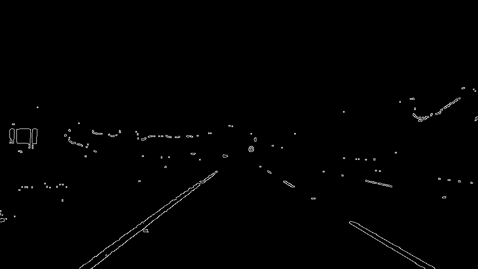
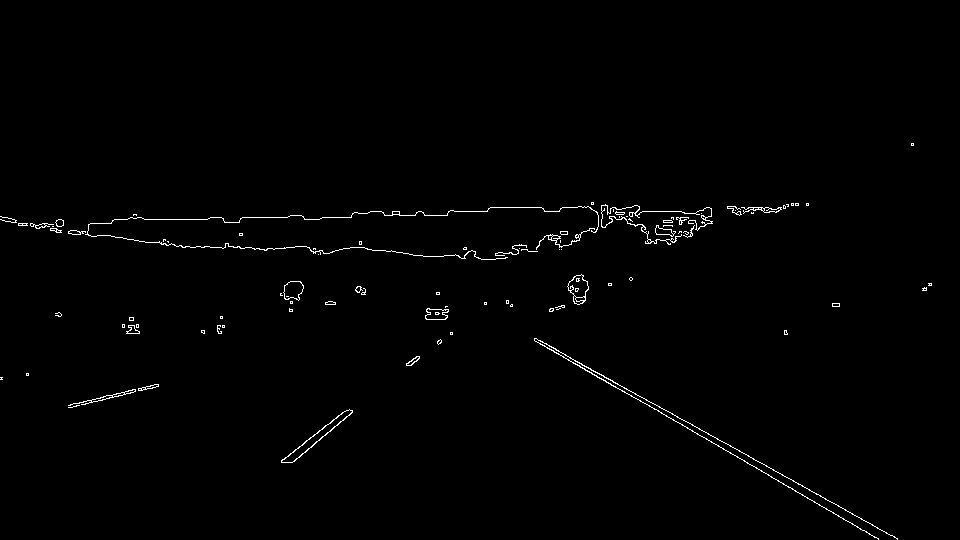
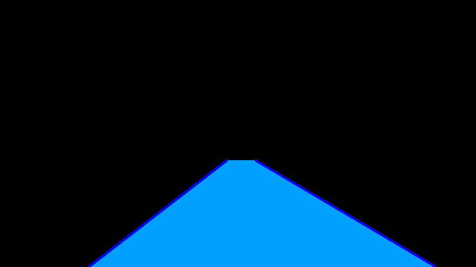
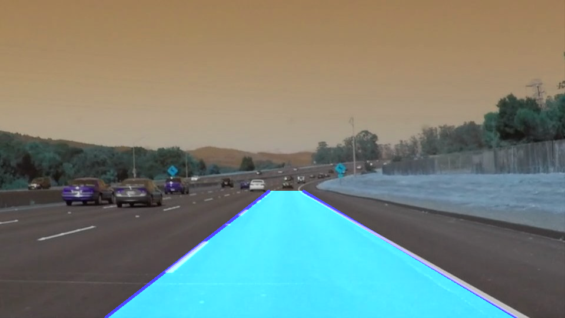

# **Self Driving Car NanoDegree** 

## Term 1. Project 1.

**Finding Lane Lines on the Road**

This project has two goals:
* Develop an algorithm that will identify lane lines on the road.
* Write a report explaining the algorithm's pipeline, as well as possible shortcomings and improvements.

The code is provided in the P1 notebook, and here we will provide a brief overlook of the algorithm.

---

### Algorithm

In the lesson, we were provided with two main tools: the Canny Edge Detector, and the Hough Transform. We were also shown how to select a particular area of the picture to work on, ignoring the regions that are unlikely to contain the elements of interest, in this case, lane lines. In addition to these tools, we found we needed a different colour scale to pick up the lane lines in different lights, and we also had to find a way to build a single left lane line and a single right lane line out of the set of lines we obtain with the Hough Transform.

In order to identify the lane lines in a particular image, we have the following pipeline:

* Change the colour scale of the image (in the lesson we used greyscale, but in this project HSV turned to be more useful). We do it by calling the appropiate cv2 function, and then filtering only the pixels that are likely to interest us: yellow and white. To filter these colours, we used an HSV range that seemed likely to capture them.
* Once we have this filtered image, we proceed to use the Canny Edge Detector, which uses the gradient of the pixels to obtain only the likely edges in the picture.

* After this, we discard all the pixels outside of our area of interest (this area of interest was obtained by observation, as a trapezoid at the bottom that has a fraction of the length and height of the image) where it is expected the lane lines will be.
* We now only have the pixels that are likely to be the edges of the image in the area where we expect to find the line lanes, so we are ready to use the Hough Transform to see which are the more likely lines behind these pixels. Once this is done, we discard all the lines that, because of their slope, are unlikely to be lane lines, and group the remaining ones into candidates for left and right lane lines.
* For each set of lines, we obtain the median slope and intercept, and then we project the resulting line to the whole area of interest we had previously defined. These two new lines are our proposed left and right lane line markers.

We can now overlay them on top of the original image:

### Potential Issues

Our pipeline depends heavily on a number of parameters, both for the functions we use and for the area we picked. These parameters have been chosen to work with the particular images and videos that were given to use, and even then, are not optimal nor systemtically obtained, and it is possible that they would fail for different settings. Here is a non - exhaustive list of shortcomings.

a) For example, we saw that we needed to change from greyscale to HSV in order to produce a sensible result in the challenge video, and there is no reason to think that a different light (or obviously a night scene), a different landscape (snow, desert, etc.) or a different road material (pebbles, dirt, etc.) would not affect the performance of our colour scale.

b) We chose which region to crop by looking at the different pictures and by testing a few different options, but that means that small changes in the camera angle (for example) could severly affect our output.

c) We are discarding valuable information as well. If there are alternative lanes to the one we are currently using, we would ideally keep track of them too.

d) Another strong assumption in this methodology was that the lanes were almost straight (we did not have any sharp bends). We could end up with a very bad approximation to the lane if we take the average (or median!) of the lines that constitute a sharp turn.

e) There were no obstacles to our image, but we could easily have a car in front of us that is covering the right or left lane lines, while also adding noise to the edge and lines detectors.

### Future Work

We will try to provide viable directions in which to attack the issues we mentioned in the previous section.

a) We should obtain a larger collection of images, depicting different scenarios, possibly classifying them by light conditions, landscape and road, to name a few obvious cathegories, and test different colour filters and settings to see which ones allow the Canny Edge Detector to work best. Then we could try and classify new images according to the above cathegories in order to chose the optimal filter and tunning.

b) We need to find a way of identifying the horizon (or vanishing point) in the image, so that we can have a more systematic way of defining the area of interest.

c) We could try and identify all the lanes available, and mark them in different colours. The current framework should allow for this in a more straightforward way than any of the other potential developments.

d) Instead of assuming straight lines, we should allow for a certain amount of curvature. The Hough transform can also be used to find curves, and not just straight lines, so we could experiment in that direction.

e) It must certainly be a priority to be able to identify other vehicles on the road, and this would allow us to also map the position of the lanes that are obscured by the obstacles. But this, at least at first hand, looks like the hardest of the problems.
